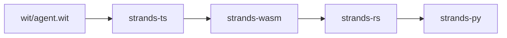
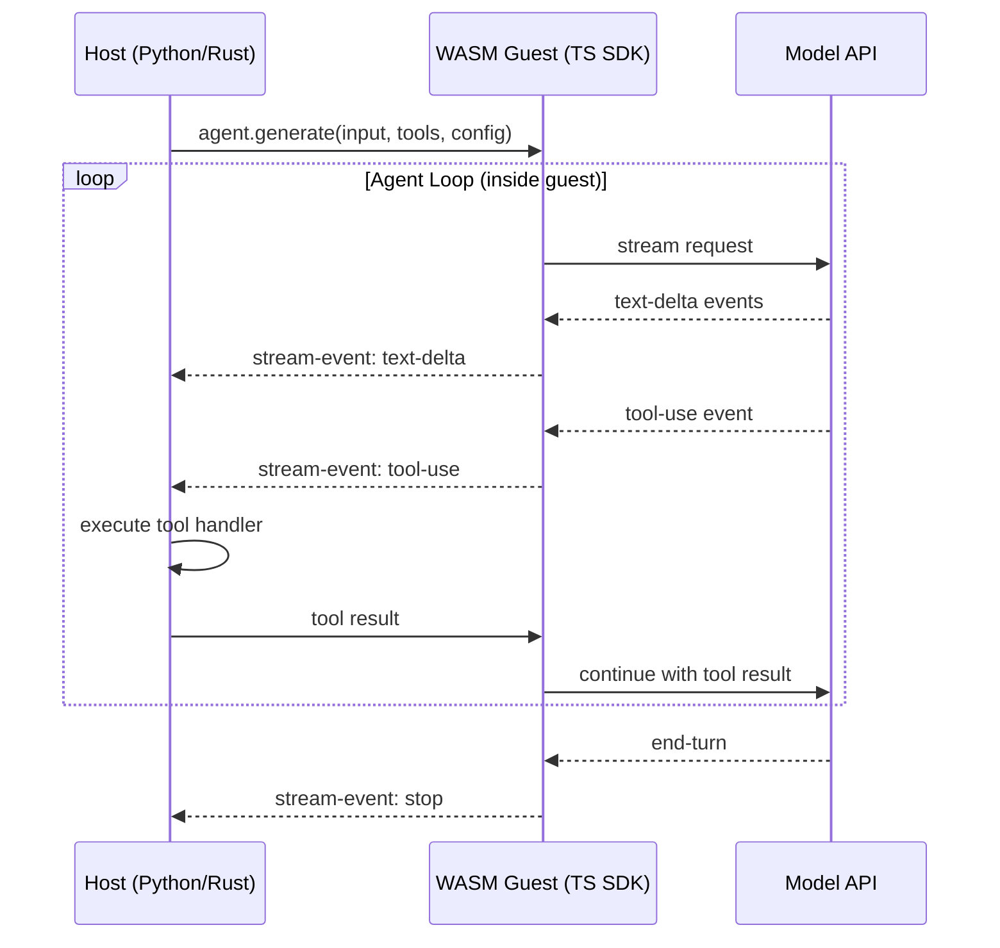

# Strands

Monorepo for the polyglot Strands agent SDK.

## Overview

The upstream Strands SDKs ([sdk-python](https://github.com/strands-agents/sdk-python), [sdk-typescript](https://github.com/strands-agents/sdk-typescript)) reimplement the agent loop, model providers, tool system, and streaming independently in each language. Each SDK ships 12+ model providers, MCP support, tool calling, and more, all written from scratch. This works well, but every new feature or integration costs N implementations for N languages.

This repo takes a different approach: define the agent interface once in WIT, implement it once in TypeScript, compile it to a WASM component, and host it from any language. New features ship to every language at the same time.

### Upstream vs. This Repo

|                     | Upstream SDKs                                                 | This Repo                                         |
| ------------------- | ------------------------------------------------------------- | ------------------------------------------------- |
| **Approach**        | Native reimplementation per language                          | Single WASM component, thin host wrappers         |
| **Feature cost**    | N implementations for N languages                             | 1 implementation, available everywhere            |
| **Model providers** | 12+ per SDK (Bedrock, Anthropic, OpenAI, Gemini, Ollama, ...) | 4 (Bedrock, Anthropic, OpenAI, Gemini), growing   |
| **Maturity**        | Production, full-featured                                     | Experimental, functional                          |
| **Debugging**       | Native stack traces, language debuggers                       | WASM boundary adds indirection                    |
| **Ecosystem**       | Direct access to pip/npm packages                             | Tools cross the WASM boundary via `tool-provider` |

## Architecture



### Data Flow



The agent loop runs entirely inside the WASM guest. The host observes stream events and executes tool handlers when the model requests them.

## Packages

### Strands SDK

| Package             | Language   | What It Does                                                                                                                                                                                                                                |
| ------------------- | ---------- | ------------------------------------------------------------------------------------------------------------------------------------------------------------------------------------------------------------------------------------------- |
| **wit/**            | WIT        | Agent interface contract and single source of truth. Defines stream events (text-delta, tool-use, tool-result, metadata, stop, error, interrupt), model configs (Anthropic, Bedrock), and the exported `agent`/`response-stream` resources. |
| **strands-ts/**     | TypeScript | Core SDK implementation. Contains the Agent class, model providers (Anthropic, Bedrock, OpenAI, Gemini), tool system (function tools, Zod tools, MCP), hooks, conversation management, and vended tools. About 25k lines.                   |
| **strands-wasm/**   | TS to WASM | Bridges the TS SDK to WIT exports via `entry.ts`, then compiles everything into a WASM component (~29MB) using esbuild and componentize-js.                                                                                                 |
| **strands-rs/**     | Rust       | WASM host. Embeds the AOT-precompiled component and runs it in Wasmtime with async support. Provides `AgentBuilder`, streaming, session persistence, and AWS credential injection. Has optional `pyo3` and `uniffi` features for FFI.       |
| **strands-py/**     | Python     | Python SDK. A PyO3 wrapper around `strands-rs` built via maturin. Adds the `Agent` class, `@tool` decorator with schema generation from type hints and docstrings, hooks, structured output (Pydantic), and hot tool reloading.             |
| **strands-derive/** | Rust       | Proc macro crate. `#[derive(Export)]` generates PyO3/UniFFI wrapper types and `from_py_dict` extractors from WIT bindgen output.                                                                                                            |

### Tooling

| Package              | Language | What It Does                                                                      |
| -------------------- | -------- | --------------------------------------------------------------------------------- |
| **strands-metrics/** | Rust     | CLI for syncing GitHub org data (issues, PRs, commits, stars, CI runs) to SQLite. |
| **strands-grafana/** | Docker   | Grafana dashboards with a SQLite datasource for the metrics above.                |

## Quick Start

```bash
# Build everything
npx dev build

# Run tests per language
npx dev test --ts
npx dev test --rs
npx dev test --py

# Full CI pipeline
npx dev ci
```

## License

Licensed under MIT or Apache-2.0.
